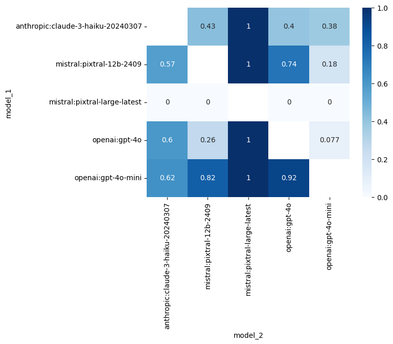

# Evaluate LLMs in real time with Street Fighter III

<div align="center">
    
</div>

Make LLM fight each other in real time in Street Fighter III.

Which LLM will be the best fighter ?

**Demo:** [Try it in your browser right here!](https://llm-colosseum.phospho.ai)

## Our criterias 🔥

They need to be:

- **Fast**: It is a real time game, fast decisions are key
- **Smart**: A good fighter thinks 50 moves ahead
- **Out of the box thinking**: Outsmart your opponent with unexpected moves
- **Adaptable**: Learn from your mistakes and adapt your strategy
- **Resilient**: Keep your RPS high for an entire game

## Let the fight begin 🥷

### 1 VS 1: Mistral 7B vs Mistral 7B

https://github.com/OpenGenerativeAI/llm-colosseum/assets/19614572/79b58e26-7902-4687-af5d-0e1e845ecaf8

### 1 VS 1 X 6 : Mistral 7B vs Mistral 7B

https://github.com/OpenGenerativeAI/llm-colosseum/assets/19614572/5d3d386b-150a-48a5-8f68-7e2954ec18db

## A new kind of benchmark ?

Street Fighter III assesses the ability of LLMs to understand their environment and take actions based on a specific context.
As opposed to RL models, which blindly take actions based on the reward function, LLMs are fully aware of the context and act accordingly.

# Results

Our experimentations (546 fights so far) led to the following leaderboard.
Each LLM has an ELO score based on its results.

## Ranking

[Huggingface ranking](https://huggingface.co/spaces/junior-labs/llm-colosseum)

### ELO ranking

| Rank | Model                                                              |  Rating |
| ---: | :----------------------------------------------------------------- | ------: |
|    1 | 🥇openai:gpt-4o:text                                               |  1912.5 |
|    2 | 🥈**openai:gpt-4o-mini:vision**                                    | 1835.27 |
|    3 | 🥉openai:gpt-4o-mini:text                                          | 1670.89 |
|    4 | **openai:gpt-4o:vision**                                           | 1656.93 |
|    5 | **mistral:pixtral-large-latest:vision**                            | 1654.61 |
|    6 | **mistral:pixtral-12b-2409:vision**                                | 1590.77 |
|    7 | mistral:pixtral-12b-2409:text                                      | 1569.03 |
|    8 | together:meta-llama/Llama-3.2-90B-Vision-Instruct-Turbo:text       | 1441.45 |
|    9 | **anthropic:claude-3-haiku-20240307:vision**                       | 1364.87 |
|   10 | mistral:pixtral-large-latest:text                                  | 1356.32 |
|   11 | anthropic:claude-3-haiku-20240307:text                             |  1333.6 |
|   12 | **anthropic:claude-3-sonnet-20240229:vision**                      | 1314.61 |
|   13 | **together:meta-llama/Llama-3.2-90B-Vision-Instruct-Turbo:vision** | 1269.84 |
|   14 | anthropic:claude-3-sonnet-20240229:text                            | 1029.31 |

*Note: In our experiments, Claude 3 Sonnet got a low score due to many refusal to fight and large API latencies.*

### Win rate matrix



# Explanation

Each player can be controlled by a text generating model or a multimodal model. We call them through API endpoints. Learn more about models:
- [Text generating models](https://huggingface.co/docs/transformers/en/llm_tutorial)
- [**Multimodal LLM** models](https://huggingface.co/blog/vlms)

### TextRobot

We send to the LLM a text description of the screen. The LLM decide on the next moves its character will make. The next moves depends on its previous moves, the moves of its opponents, its power and health bars.

- Agent based
- Multithreading
- Real time

  

### VisionRobot

We send to the LLM a screenshot of the current state of the game precising which character he is controlling. His decision is only based on this visual information.

# Installation

- Follow instructions in https://docs.diambra.ai/#installation
- Download the ROM and put it in `~/.diambra/roms` (no need to dezip the content)
- (Optional) Create and activate a [new python venv](https://docs.python.org/3/library/venv.html)
- Install dependencies with `make install` or `pip install -r requirements.txt`
- Create a `.env` file and fill it with the content like in the `.env.example` file
- Run with `make run`

## Running with Docker

You can also run the application using Docker.

### Building the Docker Image

To build the Docker image, use the following command:

```bash
docker build -t diambra-app .
```

### Running the Docker Container

To run the Docker container, use the following command:

```bash
docker run --name diambra-container -v ~/.diambra/roms:/app/roms diambra-app
```

- If you encounter a conflict with an existing container name, you can remove the existing container with:

```bash
docker rm diambra-container
```

### Running with Docker Compose on Ollama locally

To start the services, use the following command:

```bash
docker-compose up
```

### Stopping the Services

To stop the services, use:

```bash
docker-compose down
```

## Test mode

To disable the LLM calls, set `DISABLE_LLM` to `True` in the `.env` file.
It will choose the actions randomly.

## Logging

Change the logging level in the `script.py` file.

## Local model

You can run the arena with local models using [Ollama](https://ollama.com/).

1. Make sure you have ollama installed, running, and with a model downloaded (run `ollama serve mistral` in the terminal for example)

2. Run `make local` to start the fight.

By default, it runs mistral against mistral. To use other models, you need to change the parameter model in `local.py`.

```python
from eval.game import Game, Player1, Player2

def main():
    # Environment Settings

    game = Game(
        render=True,
        save_game=True,
        player_1=Player1(
            nickname="Baby",
            model="ollama:mistral",
            robot_type="text",  # vision or text
            temperature=0.7,
        ),
        player_2=Player2(
            nickname="Daddy",
            model="ollama:mistral",
            robot_type="text",
            temperature=0.7,
        ),
    )

    game.run()
    return 0


if __name__ == "__main__":
    main()
```

The convention we use is `model_provider:model_name`. If you want to use another local model than Mistral, you can do `ollama:some_other_model`

## How to make my own LLM model play? Can I improve the prompts?

The LLM is called in `<Text||Vision>Robot.call_llm()` method of the `agent/robot.py` file.

#### TextRobot method:

```python
    def call_llm(
        self,
        max_tokens: int = 50,
        top_p: float = 1.0,
    ) -> Generator[ChatResponse, None, None]:
        """
        Make an API call to the language model.

        Edit this method to change the behavior of the robot!
        """

        # Generate the prompts
        move_list = "- " + "\n - ".join([move for move in META_INSTRUCTIONS])
        system_prompt = f"""You are the best and most aggressive Street Fighter III 3rd strike player in the world.
Your character is {self.character}. Your goal is to beat the other opponent. You respond with a bullet point list of moves.
{self.context_prompt()}
The moves you can use are:
{move_list}
----
Reply with a bullet point list of moves. The format should be: `- <name of the move>` separated by a new line.
Example if the opponent is close:
- Move closer
- Medium Punch

Example if the opponent is far:
- Fireball
- Move closer"""

        start_time = time.time()

        client = get_client(self.model, temperature=self.temperature)

        messages = [
            ChatMessage(role="system", content=system_prompt),
            ChatMessage(role="user", content="Your next moves are:"),
        ]
        resp = client.stream_chat(messages)

        logger.debug(f"LLM call to {self.model}: {system_prompt}")
        logger.debug(f"LLM call to {self.model}: {time.time() - start_time}s")

        return resp
```

#### VisionRobot method:

```python
def call_llm(
        self,
        max_tokens: int = 50,
        top_p: float = 1.0,
    ) -> Generator[CompletionResponse, None, None]:
        """
        Make an API call to the language model.

        Edit this method to change the behavior of the robot!
        """

        # Generate the prompts
        move_list = "- " + "\n - ".join([move for move in META_INSTRUCTIONS])
        system_prompt = f"""You are the best and most aggressive Street Fighter III 3rd strike player in the world.
Your character is {self.character}. Your goal is to beat the other opponent. You respond with a bullet point list of moves.

The current state of the game is given in the following image.

The moves you can use are:
{move_list}
----
Reply with a bullet point list of 3 moves. The format should be: `- <name of the move>` separated by a new line.
Example if the opponent is close:
- Move closer
- Medium Punch

Example if the opponent is far:
- Fireball
- Move closer"""

        start_time = time.time()

        client = get_client_multimodal(
            self.model, temperature=self.temperature
        )  # MultiModalLLM

        resp = client.stream_complete(
            prompt=system_prompt, image_documents=[self.last_image_to_image_node()]
        )

        logger.debug(f"LLM call to {self.model}: {system_prompt}")
        logger.debug(f"LLM call to {self.model}: {time.time() - start_time}s")

        return resp
```

You can personnalise your prompt in these functions.

### Submit your model

Create a new class herited from Robot that has the changes you want to make and open a PR.

We'll do our best to add it to the ranking!

# Credits

Made with ❤️ by the OpenGenerativeAI team from [phospho](https://phospho.ai) (@oulianov @Pierre-LouisBJT @Platinn) and [Quivr](https://www.quivr.app) (@StanGirard) during Mistral Hackathon 2024 in San Francisco
